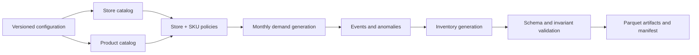
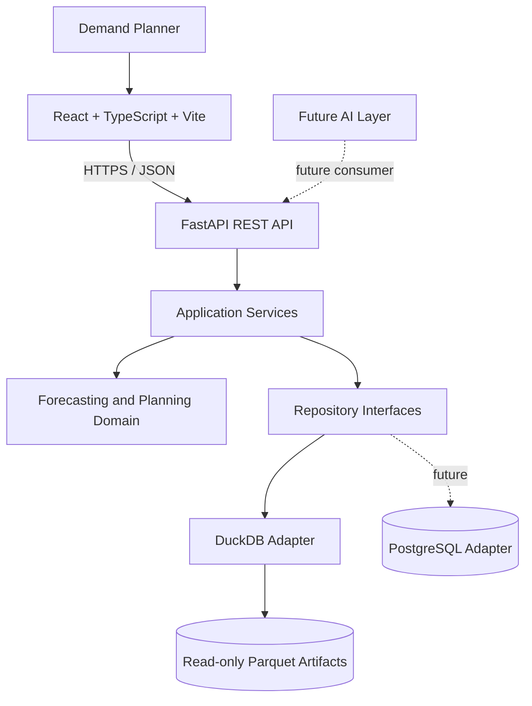
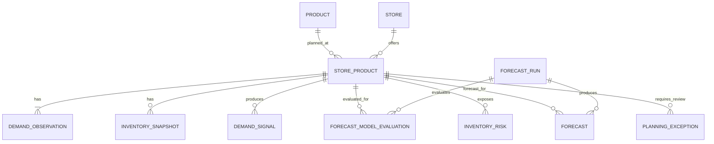
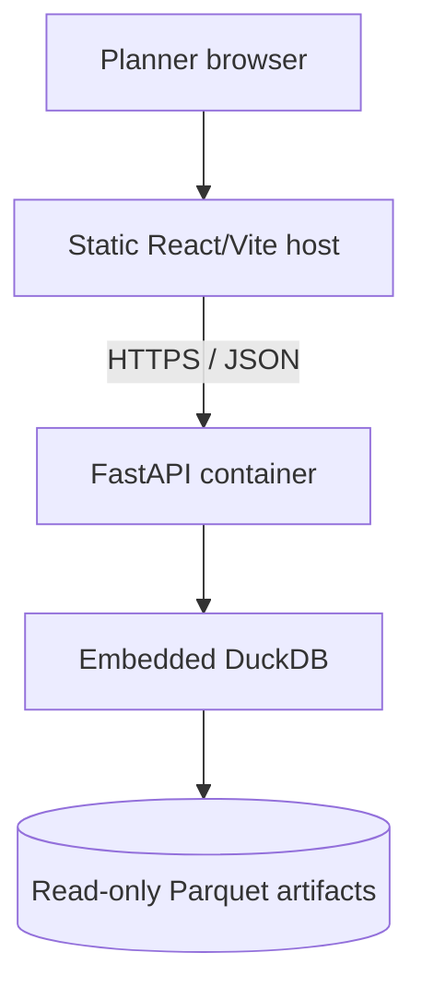

# Meridian Demand Planning

A professional, LLM-free demand-planning application for multi-store supply-chain operations.

> [!IMPORTANT]
> **Project status: Step 1 foundation.** The typed FastAPI backend, React/Vite application shell,
> automated foundation tests, and minimal local Docker workflow now exist. Synthetic reference data,
> DuckDB/Parquet adapters, forecasting, and planner functionality are not implemented. This README
> remains the approved MVP contract; sections explicitly labeled **planned** are not runnable today.

## Table of contents

- [Quick start](#quick-start)
- [How I will run Meridian locally](#how-i-will-run-meridian-locally)
- [What Meridian does](#what-meridian-does)
- [Primary user](#primary-user)
- [Product goals](#product-goals)
- [MVP scope](#mvp-scope)
- [Planner workflow](#planner-workflow)
- [Planning grain](#planning-grain)
- [Reference dataset](#reference-dataset)
- [Synthetic-data methodology](#synthetic-data-methodology)
- [Forecasting methodology](#forecasting-methodology)
- [Inventory risk](#inventory-risk)
- [Signals and planning exceptions](#signals-and-planning-exceptions)
- [Frontend and UX](#frontend-and-ux)
- [System architecture](#system-architecture)
- [Storage architecture](#storage-architecture)
- [Repository abstraction](#repository-abstraction)
- [Domain model](#domain-model)
- [REST API strategy](#rest-api-strategy)
- [Intended project structure](#intended-project-structure)
- [Local development and usage](#local-development-and-usage)
- [Data generation and validation](#data-generation-and-validation)
- [Docker](#docker)
- [Testing](#testing)
- [CI/CD](#cicd)
- [Deployment](#deployment)
- [Troubleshooting](#troubleshooting)
- [Future PostgreSQL migration](#future-postgresql-migration)
- [Future AI extension](#future-ai-extension)
- [Roadmap](#roadmap)
- [MVP definition of done](#mvp-definition-of-done)
- [Known assumptions and limitations](#known-assumptions-and-limitations)

## Quick start

The Step 1 application foundation is runnable. It shows the professional navigation shell and honest
empty states; it does not yet show stores, SKUs, demand, forecasts, or planning results.

1. Install Git and Docker Desktop.
2. Clone the repository.
3. Start the foundation from the repository root:

```bash
docker compose up --build
```

4. Open the frontend at <http://localhost:5173>.
5. Open the FastAPI documentation at <http://localhost:8000/api/docs>.
6. Stop the services when finished:

```bash
docker compose down
```

`GET http://localhost:8000/api/health` returns `200`. `GET /api/ready` intentionally returns `503`
during Step 1 because the reference artifacts and their reader do not exist yet.

### Planned data command—not implemented

```bash
python scripts/generate_data.py --config config/data/reference.yaml
```

## How I will run Meridian locally

This section explains the local experience without requiring knowledge of Meridian's internal
architecture. The Step 1 shell and operational API run today; planning data and workflows arrive in
later implementation steps.

### What I will need

| Tool | Why it will be needed |
|---|---|
| Git | To download the repository and receive future updates. |
| Docker Desktop | To run the complete application using the recommended beginner workflow. |
| Node.js 22.22.2 and npm 10.9.7 | Needed only when running or developing the frontend directly outside Docker. |
| Python 3.12.2 | Needed only when running or developing the backend or future data-generation tools directly outside Docker. |

Docker Desktop is the intended way to avoid managing those development environments separately for
normal local use. Runtime versions are pinned in `.nvmrc`, `.python-version`, and the Dockerfiles.

### What each part does

**Frontend:** The frontend will be built with React, TypeScript, and Vite. It provides the screens,
filters, charts, tables, and planning workflows that the Demand Planner uses. It runs in the browser
and requests planning information from the FastAPI backend over HTTP using JSON.

**Backend:** The backend is built with FastAPI. Step 1 provides health, readiness, OpenAPI, typed
configuration, and domain boundaries. Later services will coordinate forecasting and planning logic
and read generated Parquet reference artifacts through DuckDB.

**Data:** Meridian will use deterministic synthetic reference data stored as Parquet artifacts. These
artifacts contain the stores, products, historical demand, inventory, forecasts, signals, risks, and
exceptions used by the demonstration. They must be generated or acquired before the application can
show planning data; without them, the backend cannot serve a working planning view.

### Simple local architecture

```text
Browser
   ↓
React frontend
   ↓ HTTP/JSON
FastAPI backend
   ↓
DuckDB
   ↓
Parquet reference data
```

### Two ways I will be able to run it

#### A. Recommended beginner path

Docker Compose starts the current frontend and backend foundation and connects their local
configuration. From the repository root, run:

```bash
docker compose up --build
```

#### B. Developer path

For direct development, run the backend and frontend separately in two terminals. The verified setup
commands are documented in [Local development and usage](#local-development-and-usage). Environment
settings are copied from the committed `.env.example` files; no secrets are required for Step 1.

### What I should see when it works

- A browser opens the Meridian frontend at <http://localhost:5173>.
- The Overview, Demand Explorer, Planning Exceptions, and Forecast Runs routes load.
- Each planning route shows a clear empty or coming-soon state rather than fake business data.
- FastAPI health and documentation respond successfully.
- Readiness reports `not_ready` until reference data exists.
- Store selection, SKU search, historical demand, and reference forecasts remain planned.

### When implementation starts

- [x] Create the backend skeleton.
- [x] Create the frontend skeleton.
- [ ] Create the data-generation pipeline.
- [ ] Generate a small test dataset.
- [ ] Connect the backend to DuckDB and Parquet.
- [ ] Connect the frontend to the backend.
- [x] Add the minimal Step 1 Docker Compose foundation.
- [ ] Verify the complete data-backed local workflow.
- [x] Update this README with the **actual verified Step 1 commands**.

## What Meridian does

Meridian Demand Planning helps a Demand Planner:

- Understand historical monthly demand.
- Analyze demand by store and SKU.
- Forecast future demand with validated statistical models.
- Understand forecast error, bias, and uncertainty.
- Identify growth, decline, seasonality, volatility, spikes, drops, and anomalies.
- Identify low-stock, stockout, and excess-inventory risks.
- Prioritize the Store + SKU combinations that require review.
- Make better inventory-planning decisions.

The application is **LLM-free**. Numerical forecasts are deterministic statistical forecasts, not
"AI forecasts." ChatGPT, the OpenAI API, Ollama, Groq, and other LLM providers are not required.

The long-term vision includes an AI planning assistant that consumes trusted planning results. That
assistant is outside the MVP and must never replace the numerical forecasting engine.

## Primary user

The primary user is a **Demand Planner**.

The planner should not need to understand Python, FastAPI, DuckDB, Parquet, model-library internals,
containers, or deployment infrastructure. The product should answer business questions:

- What changed?
- What is expected to happen?
- How reliable is the forecast?
- Where is inventory at risk?
- Which Store + SKU combinations require attention?

## Product goals

1. Preserve Store + SKU detail throughout the planning workflow.
2. Automate repetitive forecasting and exception identification.
3. Compare forecasting methods honestly using time-aware validation.
4. Make forecast uncertainty and limitations visible.
5. Provide evidence for every signal and exception.
6. Deliver a polished, accessible B2B SaaS-style experience.
7. Keep the public MVP inexpensive and operationally simple.
8. Keep domain and application logic independent of storage and future LLM providers.

## MVP scope

### Included

- Exactly 5 reference stores.
- Exactly 3,500 reference products with globally unique SKUs.
- Exactly 17,500 active Store + SKU planning combinations.
- Exactly 60 consecutive completed months per Store + SKU.
- Exactly 1,050,000 historical demand observations.
- Deterministic, realistic synthetic demand and inventory.
- Store + SKU-specific planning policies.
- A precomputed six-month reference forecast for every Store + SKU.
- Configurable single-series forecast previews from 1 to 12 months.
- Rolling-origin model evaluation.
- WAPE, MASE, RMSE, bias, and prediction-interval coverage.
- Demand trends, seasonality, volatility, and anomalies.
- Inventory-risk calculations and planning exceptions.
- FastAPI REST API.
- React + TypeScript + Vite frontend.
- DuckDB queries over read-only Parquet artifacts.
- Docker and Docker Compose for local operation.
- Automated unit, repository, API, frontend, and end-to-end testing.
- GitHub Actions CI/CD.
- A publicly accessible, read-heavy demonstration.

### Non-goals

The MVP does not include:

- An LLM, Ollama, AI assistant, or autonomous agent.
- PostgreSQL as a required service.
- Next.js.
- Jenkins.
- Authentication, RBAC, or enterprise user management.
- Durable multi-user workflows or shared runtime mutations.
- Planner forecast overrides or consensus planning.
- Purchase-order creation or automated replenishment.
- ERP, WMS, or POS integrations.
- Real-time ingestion or event streaming.
- Microservices, distributed compute, a task queue, or a cache server.
- Advanced causal forecasting.
- Complex inventory optimization or multi-echelon planning.

The result is a polished B2B SaaS-style analytical demonstration, not yet a production multi-user
SaaS platform or production SLA.

## Planner workflow

The primary workflow is:

1. Open the overview and select one of the five stores.
2. Review portfolio demand, forecast reliability, inventory exposure, and priority exceptions.
3. Search for and select a SKU.
4. Open Demand Explorer.
5. Review 60 months of historical demand.
6. View the selected forecast, prediction interval, and validation metrics.
7. Review trend, seasonality, volatility, and anomaly signals.
8. Compare forecast demand with the inventory position and planning policy.
9. Review related planning exceptions and their evidence.
10. Return to the exception queue and continue with the next priority.

The public deployment primarily presents an offline, precomputed reference forecast run. It may
offer a bounded, stateless preview for one Store + SKU, but it must not allow an anonymous user to
start a full 17,500-series forecast run.

## Planning grain

The fundamental planning grain is:

```text
Store + SKU + Month
```

The canonical fact key is:

```text
store_id + product_id + period_start
```

SKU is globally unique and maps to one `product_id`.

This grain must be preserved in demand, planning policy, inventory, forecast evaluation and output,
metrics, signals, inventory risk, exceptions, API filters, frontend filters, and tests. Portfolio,
category, product, and store totals are derived aggregations; they never replace the underlying facts.

## Reference dataset

### Exact scale

```text
5 stores × 3,500 SKUs = 17,500 Store + SKU series
17,500 series × 60 completed months = 1,050,000 demand observations
```

Smaller configurations are permitted for development and tests, but they are not the reference MVP
dataset.

### Configuration

The generator accepts configuration without source-code changes:

- Store count, SKU count, and month count.
- End period, random seed, and generation timestamp.
- Output directory, schema version, and data version.
- Pattern distribution and Parquet compression.

| Setting | Reference value |
|---|---:|
| Stores | 5 |
| SKUs | 3,500 |
| Months | 60 |
| Store + SKU series | 17,500 |
| Demand rows | 1,050,000 |
| Forecast horizon | 6 months |

### Business and audit time

`period_start` represents the business month, uses the month's first calendar day, is stored as a
date, and drives forecasting. `created_at` represents artifact creation, is a timezone-aware UTC
timestamp, and is pinned in the reference configuration.

The reference `end_period` is pinned rather than derived from the current clock. Advancing it creates
a new data version. A stored zero represents true zero demand. A missing monthly record is a
data-quality error and must never be silently converted to zero.

### Product catalog

Exactly 3,500 products are generated with:

- `product_id`, `sku`, and `product_name`
- `category`, `subcategory`, and `brand`
- `unit_cost` and `unit_price`
- `created_at`

SKU is globally unique. Catalog values must be realistic enough for planner search and category
analysis.

### Store catalog

Exactly five stores are generated with:

- `store_id`, `store_code`, and `store_name`
- `city`, `region`, `country`, and `timezone`
- `created_at`

Stores differ in demand volume, category preference, seasonal behavior, volatility, and inventory
posture. They must not produce identical scaled histories.

### Store + SKU planning records

Every store is associated with every product, creating exactly 17,500 active records:

- `store_id`, `product_id`, `sku`, and `active`
- `lead_time_days`, `safety_stock`, and `reorder_point`
- `minimum_order_quantity`, `order_multiple`, and `service_level_target`
- `created_at`

Planning parameters are Store + SKU-specific. `product_id` is canonical; repeated SKU values are
validated against the product catalog.

### Demand observations

Demand facts contain `store_id`, `product_id`, `sku`, `period_start`, `demand_units`, and `created_at`.
The target represents unconstrained demand rather than fulfilled sales, avoiding the incorrect
assumption that stockout-censored sales equal customer demand.

Required invariants:

- Exactly one row per Store + SKU + month.
- Exactly 60 rows per Store + SKU and 1,050,000 rows overall.
- Nonnegative integer demand.
- No duplicate or missing periods.
- Valid store and product references.
- One continuous completed-month range.

### Inventory snapshots

The reference artifacts contain one current position per Store + SKU:

- `store_id`, `product_id`, and `sku`
- `snapshot_at`
- `on_hand`, `allocated`, and `on_order`
- `on_order_due_within_lead_time`
- `next_expected_receipt_at`
- `lead_time_days` and `safety_stock`
- `created_at`

Lead time and safety stock are canonical in the Store + SKU planning record. Their snapshot values
capture the policy used during evaluation and must remain consistent.

Required scenarios are healthy inventory, low stock, potential stockout, excess inventory, high
demand with insufficient stock, and inventory supported by incoming stock.

## Synthetic-data methodology



Each Store + SKU series combines product/category baseline, store characteristics, lifecycle/trend,
annual seasonality, store-specific seasonal effects, random variation, intermittency, and controlled
events.

The portfolio includes stable, growing, declining, seasonal, strongly seasonal, volatile,
intermittent, spike, drop, mature, new-product-like, store-specific, and occasional outlier behavior.
Because all series require complete history, new-product-like means a recent ramp or structural change,
not missing pre-launch records.

Use stable keyed random streams derived from the seed and stable entity keys. Adding a product must
not unexpectedly change existing series. Reproducibility means identical logical records under the
pinned toolchain and configuration; Parquet bytes may differ across tool versions. Checksums identify
published artifact versions.

Synthetic ground-truth labels are separate test evidence. Detection logic must infer behavior from
planner-facing facts rather than reading those labels.

## Forecasting methodology

Forecast independently for every Store + SKU. The reference horizon is six months; bounded
single-series previews support 1–12 months.

### Candidate registry

| Demand type | Candidates |
|---|---|
| Regular | Naive, Seasonal Naive, Random Walk with Drift, AutoETS, AutoTheta |
| Intermittent | Naive, eligible Seasonal Naive, CrostonOptimized or comparable |

AutoARIMA is deferred unless later benchmarking demonstrates sufficient value at acceptable cost.

Eligibility considers effective history, seasonal requirements, non-zero frequency, inter-demand
intervals, all-zero demand, and fitting success. All-zero series receive zero forecasts. One failed
candidate is recorded and skipped; it cannot fail the overall run.

### Rolling-origin validation

Random train/test splitting is prohibited.

For the reference horizon:

- Minimum initial training: 36 months.
- Validation horizon and step: 6 months.
- Expanding validation origins: 4.

For other horizons, retain 36 months of initial training, use up to four recent origins, require at
least two, and use the forecast horizon as the step. If two origins do not fit, return an explicit
insufficient-validation result. Every target must occur after its training cutoff.

The winner is refitted on all history through the production cutoff.

### Metrics and selection

| Metric | Purpose |
|---|---|
| WAPE | Aggregate business-facing error magnitude |
| MASE | Scale-independent comparison |
| RMSE | Sensitivity to large errors |
| Bias | Systematic over- or under-forecasting |
| Interval coverage | Validation actuals inside the prediction interval |

Calculate WAPE across all validation observations:

```text
sum(abs(actual - forecast)) / sum(abs(actual))
```

WAPE is null when validation actuals sum to zero. MASE documents its scaling baseline and is null when
undefined. Portfolio WAPE uses aggregated errors, not average per-series WAPE. Never describe
`100 - WAPE` as forecast accuracy.

Deterministic selection order:

1. Lowest defined WAPE.
2. Lowest MASE.
3. Lowest absolute bias.
4. Lowest RMSE.
5. Simpler model when effectively tied.

### Prediction intervals

Every forecast includes a value and lower/upper bounds. The default interval is 90%, using a suitable
model interval or residual/conformal calibration from rolling-origin errors. Forecasts and lower bounds
cannot be negative.

Store interval coverage and validation sample size. Per-series coverage is descriptive evidence, not a
guarantee; portfolio coverage is more stable.

### Immutable forecast artifacts

Offline reference artifacts include forecast runs, candidate evaluations, forecasts, metrics, signals,
inventory risks, and exceptions. The public runtime reads them and does not add a DuckDB write path.

A preview is restricted to one Store + SKU and a 1–12 month horizon. It is stateless and non-persistent.

## Inventory risk

```text
projected inventory at replenishment arrival
  = on_hand
  - allocated
  + on_order_due_within_lead_time
  - forecast_demand_during_lead_time
```

Allocate monthly forecast demand across the actual days in each month and sum the days overlapping the
lead-time window.

Risk categories:

- `stockout`: projected inventory below zero.
- `below_safety_stock`: nonnegative but below safety stock.
- `healthy`: meets safety stock and remains below excess threshold.
- `excess`: coverage exceeds a configured maximum.

Evidence includes on-hand, allocated, total and due on-order units, lead-time forecast demand,
projected inventory, safety stock, coverage, thresholds, and configuration version. The MVP identifies
risk; it does not optimize inventory or create orders.

## Signals and planning exceptions

Detect growing, declining, stable, volatile, seasonal, spike, drop, and potential-anomaly signals.
Use understandable evidence such as robust slope, recent/prior averages, robust variability, seasonal
strength, residuals, and median-absolute-deviation scoring. Require meaningful absolute change to
suppress low-volume noise.

Every signal includes Store + SKU, relevant period, type/direction, metric, baseline, threshold, and
structured evidence.

Initial exceptions:

- Potential stockout or below safety stock.
- Excess inventory.
- Demand spike or decline.
- High forecast uncertainty.
- Significant forecast bias.

Each exception includes its ID, Store + SKU, period, type, severity, status, title, business description,
metric, threshold, evidence, related run/signal, and created timestamp.

Statuses are Open, Acknowledged, Resolved, and Dismissed. These states and transitions are domain rules
and are tested. The public read-only demo may show reference states but does not promise durable user
updates. Assignment, comments, approvals, and escalation are outside scope.

## Frontend and UX

Use React, TypeScript, Vite, React Router, TanStack Query, an accessible lightweight chart library, and
reusable components governed by design tokens. Do not use Next.js.

The UI is modern, minimal, professional, accessible, responsive, decision-oriented, restrained in
color, generous in whitespace, and consistent in typography and spacing. Avoid developer-dashboard
aesthetics, excessive gradients/animation/colors/charts, dense screens, irrelevant technical details,
and meaning conveyed only by color.

Primary navigation:

1. Overview.
2. Demand Explorer.
3. Planning Exceptions.
4. Forecast Runs.

Demand Explorer is central. Global controls include store, debounced SKU search, optional category,
time period, and forecast run. Do not render 3,500 SKUs in a static dropdown.

Overview shows recent and forecast demand, inventory-risk combinations, high-priority exceptions,
portfolio WAPE/bias, and a prioritized exception table. Avoid a generic KPI-card wall.

Demand Explorer shows product/policy details, history, forecast, WAPE/MASE/RMSE/bias/coverage, signals,
inventory/risk evidence, exceptions, and planner-friendly run metadata.

The primary Actual vs Forecast chart uses a solid actual line, dashed forecast line, true lower-to-upper
interval band, restrained anomaly markers, forecast cutoff, accessible tooltip/legend, and text summary.
Supporting information uses concise tables, badges, cards, and summaries rather than extra charts.

## System architecture



The MVP is a modular monolith with no microservices, queue, cache server, database server, or LLM.

The browser talks to FastAPI; it never reads Parquet. Application services orchestrate retrieval,
completeness checks, previews/offline runs, evaluation, signals, risk, exceptions, and API assembly.

The domain must not depend on FastAPI, HTTP, DuckDB, Parquet, CSV, PostgreSQL, frontend code, or LLMs.

## Storage architecture

| Component | Responsibility |
|---|---|
| Parquet | Persisted analytical facts and derived reference artifacts |
| DuckDB | Embedded analytical queries over Parquet |
| CSV | Optional bounded import/export only |
| PostgreSQL | Future transactional adapter |

DuckDB + Parquet fits an immutable, read-heavy analytical dataset of this size without a database
server. Its accepted limitations are immutable replacement files, no shared multi-user transactions,
no row locks, validation-enforced integrity, no shared mutable state between instances, artifact-style
recovery, and single-node operation.

### Planned artifacts

```text
data/generated/
├── manifest.json
├── stores.parquet
├── products.parquet
├── store_products.parquet
├── demand_history/                 # layout selected by benchmark
├── inventory_snapshots.parquet
├── forecast_runs.parquet
├── forecast_model_evaluations.parquet
├── forecasts.parquet
├── demand_signals.parquet
├── inventory_risks.parquet
├── planning_exceptions.parquet
└── synthetic_ground_truth.parquet
```

Do not create a file per SKU.

### Parquet layout benchmark

Compare one sorted demand file, five store partitions, and approximately 25 store/year partitions.
Measure Store + SKU lookup, store/date and category/portfolio aggregation, DuckDB initialization,
compressed size, file count, image size, and startup time. Choose the simplest adequate layout.

### Manifest and Git policy

`manifest.json` records schema/data/generator versions, configuration hash, seed, end period,
generation timestamp, all row counts, period range, run IDs, checksums, and compression. Backend
readiness requires successful manifest and DuckDB validation.

Commit generator code/configuration, schemas, validation, documentation, seed metadata, and small
fixtures. Exclude full Parquet/forecast artifacts, temporary DuckDB files, caches, and test reports.

## Repository abstraction

Use Store, Product, StoreProduct, Demand, Inventory, ForecastRun, Forecast, Signal, InventoryRisk, and
PlanningException repositories.

They accept typed queries and return canonical DTOs or efficient columnar batches. They never expose
DuckDB connections/relations, SQL, Parquet paths, filesystem details, or storage IDs. Do not construct
one million Pydantic objects; canonical Pandas/NumPy/Arrow-compatible batches are acceptable while
DuckDB types stay inside the adapter.

Separate read and write capabilities. Public runtime uses read-only adapters; offline pipelines use
writers. Future PostgreSQL adapters must pass the same contract tests.

## Domain model



Core concepts are Store, Product, StoreProduct, DemandObservation, InventorySnapshot, ForecastRun,
ForecastModelEvaluation, Forecast, DemandSignal, InventoryRisk, and PlanningException. Their rules do
not depend on storage format.

## REST API strategy

All versioned endpoints use `/api/v1`.

| Area | Planned endpoint |
|---|---|
| Catalog | `GET /stores`, `/products`, `/products/{id}`, `/store-products` |
| Demand | `GET /demand/series`, `/demand/summary` |
| Inventory | `GET /inventory/positions`, `/inventory/risks` |
| Forecast | `GET /forecast-runs`, `/forecast-runs/{id}`, `/forecast-runs/{id}/evaluations`, `/forecasts` |
| Preview | `POST /forecast-previews` |
| Signals | `GET /signals`, `/trends`, `/anomalies` |
| Exceptions | `GET /exceptions`, `/exceptions/{id}` |
| Dashboard | `GET /dashboard/summary`, `/dashboard/planning-view`, `/dashboard/exception-summary` |
| Operations | `GET /api/health`, `/api/ready`, `/api/docs`, `/api/openapi.json` |

Demand responses require bounds, filters, pagination, and maximum sizes. No normal endpoint returns the
million-row dataset. Preview accepts exactly one Store + SKU and horizon 1–12, is stateless, and may be
rate-limited or disabled on constrained hosting. Public full-run creation and durable exception
mutation are excluded. Frontend types are generated from or contract-tested against OpenAPI.

## Intended project structure

The Step 1 foundation establishes the dependency boundaries below. Generator/configuration files shown
as planned are added with the data pipeline, not fabricated as empty executables in this step:

```text
.
├── backend/
│   ├── app/
│   │   ├── api/
│   │   ├── application/
│   │   ├── domain/
│   │   ├── ports/repositories/
│   │   ├── infrastructure/{duckdb,parquet,memory}/
│   │   ├── schemas/
│   │   └── main.py
│   ├── tests/{unit,repository,integration}/
│   └── pyproject.toml
├── frontend/
│   ├── src/{api,components,features,pages,styles,test}/
│   └── package.json
├── scripts/                         # planned generator entry points
├── config/data/                     # planned reference/test profiles
├── data/{schemas,samples,generated}/
├── e2e/
├── docs/
├── docker-compose.yml
└── README.md
```

Names may be refined, but dependency boundaries must remain.

## Local development and usage

The Step 1 shell can be started now. The complete data-backed flow remains clone → configure →
generate/acquire artifacts → start backend/frontend → wait for readiness → open Demand Explorer.

### Endpoint contract

| Endpoint | Current value |
|---|---|
| Frontend URL | <http://localhost:5173> |
| Backend URL | <http://localhost:8000> |
| Future business API base | <http://localhost:8000/api/v1> |
| Swagger | <http://localhost:8000/api/docs> |
| Health | <http://localhost:8000/api/health> |
| Readiness | <http://localhost:8000/api/ready> |

Committed `.env.example` files contain no secrets. `VITE_API_BASE_URL` changes the backend origin
without source edits. Backend variables currently cover environment, artifact location/version, CORS,
preview limits, and logging. DuckDB-specific settings arrive with the DuckDB adapter.

### Direct development contract

Backend and frontend run in two terminals for direct development. Use Python 3.12.2:

```bash
cd backend
python3 -m venv .venv
.venv/bin/python -m pip install --requirement dev-requirements.lock
.venv/bin/uvicorn app.main:app --reload --port 8000
```

Use Node.js 22.22.2 and npm 10.9.7 in the second terminal:

```bash
cd frontend
npm ci
npm run dev
```

Copy the relevant `.env.example` to `.env` only when overriding the safe defaults. The frontend opens
on port 5173 and communicates with the backend on port 8000.

## Data generation and validation

Generated artifacts normally live in `data/generated/` and are excluded from Git.

| Profile | Purpose | Demand rows |
|---|---|---:|
| Reference | Demo/release | 1,050,000 |
| Test | Fast local/PR checks | Smaller, schema-equivalent |

Planned commands, not yet runnable:

```bash
python scripts/generate_data.py --config config/data/reference.yaml
python scripts/generate_data.py --config config/data/test.yaml
```

Implementation must document overwrite behavior, version selection, validation, count reporting,
forecast generation, and stale artifact detection. Safe default: never overwrite an existing version
without an explicit flag or new output directory.

Reference validation reports 5 stores, 3,500 unique SKUs, 17,500 planning records, 1,050,000 demand
rows, 60 months per series, and valid checksums.

## Docker

The current Compose file provides only the backend and frontend foundation. It does not pretend that
reference data, DuckDB adapters, or Playwright services exist. DuckDB will run inside the backend in a
later step, not as a separate container.

Verified commands:

```bash
docker compose up --build  # build after dependency/Dockerfile changes and start
docker compose up          # start existing images
docker compose down        # stop/remove app containers and network
```

The `backend` service publishes port 8000 and the `frontend` service publishes port 5173. Reference
artifact mounts and data readiness remain planned; future artifact mounts must be read-only.

## Testing

Required coverage:

- Synthetic data: determinism, exact counts, unique keys, 60-month completeness, timestamps,
  references, nonnegative values, pattern distribution, store differentiation, and manifest.
- Forecasting: metrics, undefined denominators, zero/intermittent demand, eligibility, rolling windows,
  no leakage, deterministic selection, failure isolation, intervals, coverage, and horizon limits.
- Inventory/exceptions: healthy/low/stockout/excess, allocations, on-order timing, calendar-day lead
  time, evidence, severity, traceability, deduplication, and lifecycle rules.
- Repositories/API: Parquet/manifest reading, filters, pagination, ordering, aggregation, missing data,
  parameterized queries, validation, bounded responses, errors, health/readiness, and previews.
- Frontend: selection/search, dashboard/explorer, formatting, interval rendering, signals, risk,
  exceptions, loading/empty/error states, keyboard/focus/labels, and accessibility.
- Playwright: store → SKU → history → forecast/interval → metrics → signals → risk → exceptions.

Avoid brittle tests requiring a complex model to win when scores are effectively tied. Critical E2E
tests run in CI and are not intentionally skipped.

| Task | Verified command |
|---|---|
| Backend tests | `cd backend && .venv/bin/pytest` |
| Backend formatting | `cd backend && .venv/bin/ruff format --check .` |
| Backend lint | `cd backend && .venv/bin/ruff check .` |
| Backend type check | `cd backend && .venv/bin/mypy app tests` |
| Frontend formatting | `cd frontend && npm run format:check` |
| Frontend tests | `cd frontend && npm run test` |
| Frontend lint | `cd frontend && npm run lint` |
| Frontend type check | `cd frontend && npm run typecheck` |
| Frontend production build | `cd frontend && npm run build` |
| Playwright E2E | TBD |
| Test/reference data validation | TBD |
| Reference forecast generation | TBD |
| Step 1 local startup | `docker compose up --build` |

## CI/CD

GitHub Actions is the MVP platform; Jenkins is excluded.

PR CI uses the smaller deterministic profile and runs formatting, linting, static types, backend,
repository, integration, API, frontend, build, Playwright, dependency, and secret checks.

Manual/scheduled/release CI:

1. Generates exactly 1,050,000 demand rows.
2. Validates schemas, keys, completeness, and behavior distribution.
3. Generates full reference forecasts, signals, risks, and exceptions.
4. Validates manifest/checksums.
5. Publishes artifacts or builds the deployment image.
6. Runs smoke/E2E tests against reference artifacts.
7. Records generation, forecast, query, layout, and startup benchmarks.

Do not run full reference forecasting on every pull request.

## Deployment



Potential categories include Cloudflare Pages/comparable static hosting, Render/comparable container
hosting, and S3-compatible storage. Exact providers, prices, quotas, regions, and limits are subject to
verification at deployment time. GitHub Pages is not full-stack hosting because it cannot run FastAPI
or DuckDB.

### Artifact delivery

If benchmarked image size/cold start are acceptable, CI packages validated artifacts in the immutable
backend image. Otherwise, publish a versioned object artifact, download it to ephemeral storage at
startup, verify checksums, initialize DuckDB, then report readiness.

The fallback lowers image size but increases cold-start time, bandwidth, and external dependency. The
decision is benchmarked, not assumed. Never generate reference data on backend startup.

### Hosting limitations

Expect sleep/cold starts, ephemeral filesystems, CPU/memory/build/bandwidth/image limits, restarts,
single-node operation, no durable writes, concurrent-user contention, and expensive full forecasting.
Mitigate with precomputed forecasts, immutable artifacts, bounded previews, selective queries,
pagination, limited concurrency, cache-friendly immutable responses, and documented cold starts.

Use an inexpensive always-on backend for scheduled demonstrations if sleep is unacceptable.

## Troubleshooting

Concrete commands must come from implementation; required guidance is:

| Problem | Checks |
|---|---|
| Docker unavailable | Start/restart Docker Desktop and confirm daemon health |
| Port conflict | Identify occupying process or change port through environment config |
| Frontend failure | Check supported Node/npm, lockfile install, API URL/proxy, logs |
| Backend failure | Check Python/toolchain, lockfile, artifact config, startup logs |
| Dataset missing/incomplete | Check directory/manifest, run validation, verify exact counts |
| Readiness failure | Check versions/checksums/schema and DuckDB readability |
| Frontend cannot reach API | Test health URL, verify API base, inspect browser request |
| CORS | Verify exact frontend origin and distinguish from connectivity errors |
| Missing environment | Compare with `.env.example`, never commit secrets, restart service |
| Runtime mismatch | Use pinned versions or Docker; recreate environment after changes |
| Docker build failure | Inspect first error and Docker disk/memory; rebuild when inputs change |
| Slow startup | Account for provider wake, image pull, artifact download/validation |
| Stale artifacts | Compare manifest versions; regenerate/reacquire a complete version |

Do not mix files from different artifact versions.

## Future PostgreSQL migration

PostgreSQL becomes appropriate for durable user actions, multiple planners, authentication, concurrent
runs/imports, overrides, and multiple backend replicas.

Migration:

1. Define schema and constraints.
2. Add migrations.
3. Load Parquet data.
4. Implement PostgreSQL repository adapters.
5. Run shared repository contract tests.
6. Change dependency injection.
7. Enable durable writes/endpoints.
8. Add authentication and planner identity.

This requires infrastructure work but should not redesign forecasting, metrics, signals, inventory
risk, exception rules, API contracts, or frontend workflows.

## Future AI extension

The MVP works without any LLM. A future layer may consume validated demand summaries, forecasts,
metrics, signals, risks, and exceptions to provide explanations, insights, summaries, recommendations,
conversational planning, and eventually a governed planning agent.

It must not produce numerical forecasts, bypass validation, hide uncertainty, silently change
forecasts, or become required for core availability. Ollama is an optional future provider only.

## Roadmap

1. PostgreSQL and durable planner workflows.
2. Authentication, RBAC, identity, and audit history.
3. Overrides and consensus planning.
4. Scheduled runs and controlled imports.
5. ERP/POS/WMS integration.
6. Promotion, pricing, holiday, and event features.
7. Hierarchical reconciliation and richer inventory policy.
8. AI explanations and recommendations.
9. Conversational planning and a governed agent.

## MVP definition of done

### Data

- [ ] 5 stores, 3,500 unique SKUs, 17,500 active combinations, and 1,050,000 demand rows.
- [ ] Exactly 60 completed months per series; missing/duplicate periods fail.
- [ ] Business/audit timestamps and required scenarios are valid and deterministic.
- [ ] Artifacts are excluded from Git, versioned, validated, and checksummed.

### Forecasting and planning

- [ ] Store + SKU forecasts use rolling-origin validation without leakage.
- [ ] Six-month reference and 1–12 month previews work.
- [ ] Eligibility, failure isolation, WAPE, MASE, RMSE, bias, and coverage are honest.
- [ ] Prediction intervals, evidence-backed signals, and lead-time inventory risk exist.
- [ ] Full reference results are immutable artifacts.

### Product and architecture

- [ ] React/TypeScript/Vite and FastAPI are used; Next.js is not.
- [ ] DuckDB queries read-only Parquet through repository interfaces.
- [ ] Domain logic has no FastAPI/storage/frontend/LLM dependency.
- [ ] Demand Explorer is polished, responsive, accessible, and central.
- [ ] Public runtime is read-only except bounded stateless previews.

### Quality and delivery

- [ ] Verified quick-start, direct-development, test, and troubleshooting commands exist.
- [ ] Docker Compose starts the app.
- [ ] All automated test layers pass in GitHub Actions.
- [ ] Release CI validates full artifacts.
- [ ] Layout and artifact delivery are benchmark-selected.
- [ ] A public demo works without PostgreSQL or an LLM.

## Known assumptions and limitations

- All business data is synthetic; its forecast performance does not prove real-world performance.
- Demand represents unconstrained demand, not fulfilled sales.
- New-product behavior is a complete-history ramp/structural change.
- The public demo is read-only, single-node, and not a production SLA.
- Full forecasting is offline; previews are bounded and non-persistent.
- Exception changes are not durably shared.
- DuckDB + Parquet does not provide PostgreSQL-style transactions.
- Per-series interval coverage has a limited sample.
- Inventory risk uses simplified monthly forecasts and lead-time overlap.
- Promotions, price, holidays, assortment history, and causal features are not explicit MVP inputs.
- Free hosting may sleep or impose restrictive resource limits.
- Hosting providers, pricing, quotas, and later data/forecast commands require verification when those
  implementation steps exist.
- PostgreSQL is expected when the product becomes a durable multi-user application.
