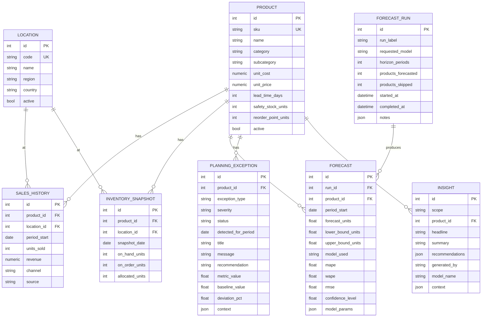

# Entity-Relationship Diagram

## Notable constraints

- `sales_history`: unique on `(product_id, location_id, period_start)`,
  indexed on `(product_id, period_start)` for the timeline queries.
- `inventory_snapshots`: unique on `(product_id, location_id, snapshot_date)`.
- `forecasts`: unique on `(run_id, product_id, period_start)`.
- `planning_exceptions`: indexed on `(status, severity)` for the alerts
  queue, and `(product_id, exception_type)` for the product drill-down.
- All product-owned tables cascade-delete when the parent `Product` is
  deleted (the API only exposes soft-delete/deactivation, but the schema
  supports a real delete for data cleanup/testing).

Generated from the SQLAlchemy models in
[`backend/app/models/`](../backend/app/models); the live schema is created by
the Alembic migration in
[`backend/alembic/versions/`](../backend/alembic/versions).
